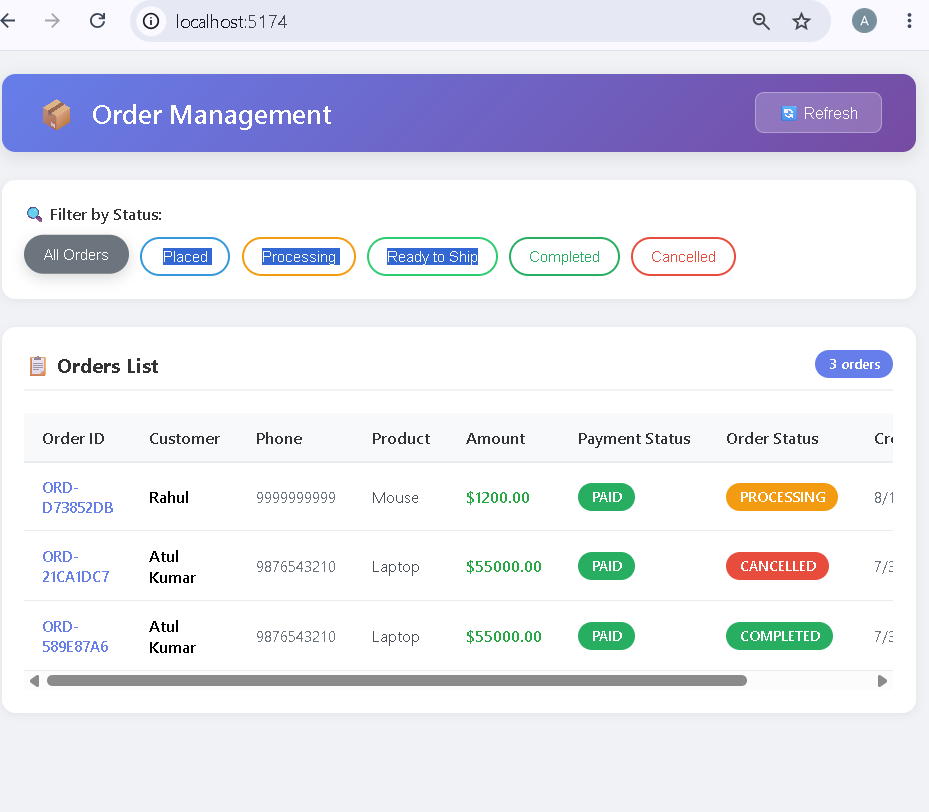

# Order Management System

## Project Overview

A Full Stack Order Management System built using React.js, Node.js, Express.js and MongoDB.

This project allows users to:

- Create Orders
- View Orders
- Filter Orders by Status
- Update Order Status
- Automatically update status using Cron Scheduler
- Store Status History
- Store Scheduler Logs

---

## Tech Stack

### Frontend

- React.js
- Axios
- CSS

### Backend

- Node.js
- Express.js
- MongoDB
- Mongoose
- Node Cron

---

## Folder Structure

backend/
frontend/

---

## Installation

### Backend

```bash
cd backend
npm install
npm run dev
```

### Frontend

```bash
cd frontend
npm install
npm run dev
```

---

## Environment Variables

Backend (.env)

```env
PORT=5000
MONGODB_URI=mongodb://localhost:27017/order_management
FRONTEND_URL=http://localhost:5173
SCHEDULER_SECRET=your-secret-key
```

---

## APIs

POST /api/orders

GET /api/orders

GET /api/orders/:id

PUT /api/orders/:id/status

DELETE /api/orders/:id

POST /api/scheduler/run

GET /api/scheduler/logs

GET /api/scheduler/stats

---

## Scheduler

Runs every 5 minutes.

Status Flow

PLACED

↓

PROCESSING

↓

READY_TO_SHIP

↓

COMPLETED

Scheduler execution logs are stored in MongoDB.

---

## Database Collections

- Orders
- StatusHistory
- SchedulerLogs

---

## Features

- Create Order
- Update Status
- Delete Order
- Status Filter
- Loading State
- Empty State
- Error Handling
- Auto Refresh
- Pagination
- Scheduler Logs

---

## Future Improvements

- Authentication
- Search
- Sorting
- Deployment
## Output Screenshots

### Dashboard



### All Orders


### Placed Orders


### Processing Orders


### Completed Orders


### Cancelled Orders


### Get Orders API

